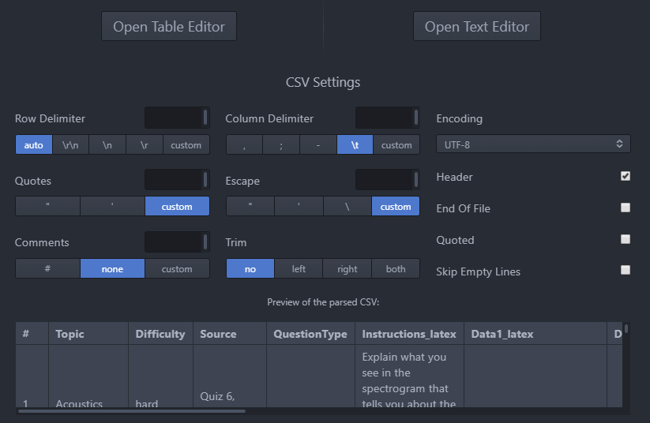

# LING 200 exam generation

## Quick Start - how to run:
*** As of Sep 17 2020, all four tsvs in "examgeneration" directory are correctly formatted and functional.
1.	Update/save questions spreadsheet as tsv
2.	Save signups spreadsheet as tsv - TODO update this after talking to Kathleen 20200921
5.	Customize config file as per instructions in next section
6.	Run generateexams.py (it looks for a command-line argument with the name of the config file, but if it doesn't find one will ask you for input). This creates .tex files.
7.	Open generated .tex sources (generated in a timestamped subdirectory) and compile into pdfs using your favourite LaTeX editor (or you could uncomment the pdf generation lines in the python script, but be aware that these don't handle compilation errors at all gracefully and you could end up with both latex and python processes hanging). Note that you have to use the XeLaTeX engine in order for IPA fonts to work correctly.

### Config file formatting:
* Can be named whatever you like.
* Properties can go in any order (ie, entire lines can switch spots).
* Required properties: 
  * questions
  * signups
* Optional properties: 
  * exam type (default = final)
  * student groups (default = none / separate ids with comma / separate groups with semicolon / spaces are ok)
  * random seed (default = wugz)
* Property keys and values must be typed as shown in this example:
```
questions: pathtoquestionsfile_dontusespaces.tsv
signups: pathtosignupsfile/couldbenested.tsv
exam type: midterm
student groups: 1234,3456;8846,2345,1220
random seed: whateveryoulike could have spaces
```

### Current midterm exam characteristics:
* 5 questions total: one each from topics transcription, articulatory phonetics, skewed distributions, phonological relationships, and "wild" (wildcard question randomly selected from transcription, articulatory phonetics, phonological relationships, or other).
* Difficulty distribution is either (1x very hard, 5x medium), or (1x very hard, 1x hard, 2x medium, 1x easy).
* Because of the fact that there is a not a full crossing of difficulty & topic, the choosing of questions for midterms is done in an annoyingly hard-coded way. If the question coverage were to improve, we could use the more elegant (and more random) algorithm that's used for the final exams.

### Current final exam characteristics:
* 6 questions total: one each from topics acoustics, alternations,  phonological features, syllables, tone, and dataset.
* Difficulty distribution is (2, easy, 2x medium, 1x hard, and 1x very hard). Very hard always comes from the dataset questions.
* The non-dataset topics fully cross the difficulty levels easy/medium/hard, so there's lots of opportunity for randomness in terms of which topics get which difficulties, etc.

### Shared characteristics:
* Any students who are grouped together in the config file (eg, who worked together on assignments) will not have any overlap in exam questions (TODO though could have overlap in sources, just with different actual data).
* No individual student's exam will have more than one question with the same question type (eg morphology, signlanguage, etc), based on optional entries in the "QuestionType" column of the questions spreadsheet.

### LaTeX compiling:
* In order to make it easy to use verbatim input of ipa characters, I am using font packages that require compilation with xelatex.
* pdflatex will not work.

### Student groups:
* Any students listed in a group together (see config) will *not* have overlap in their exam questions, but could have overlap in their question sources. For example, the following is currently possible within a group:
  * From source "Day 2 Handout, Question 6" student A gets "Provide the IPA transcription for the word 'grilled'."
  * From source "Day 2 Handout, Question 6" student B gets "Provide the IPA transcription for the word 'cheese'."
  
### Updating question banks (tsvs):
Please be careful about how you edit these (it was pretty easy in google drive, but now that they're in github it's a little less foolproof).
* I am using the [tablr package for atom editor](https://atom.io/packages/tablr), with the bug fix and settings as shown below:
  * There is an error that occurs with the standard tablr install. This can be fixed either [like this](https://github.com/abe33/atom-tablr/issues/100#issuecomment-515094622) like I did on my Windows machine, or [like this instead](https://github.com/abe33/atom-tablr/issues/100#issuecomment-406904774) which I haven't tried.
  * Settings for reading our exam questions from tsv in atom: 
    
    Format: 
* I have not successfully used Excel to import a tsv, edit it, and export back to tsv without various encoding errors.
* There may well be other bare-bones tsv editors that arrange data nicely on the screen without messing with it, but I haven't looked any further than the atom package I mentioned above. Let me know if you find anything else (and/or just add info here).

### Question subtypes:
* There is a column in the questions spreadsheet called QuestionType. If a value is entered in this column (e.g. "UR" or "signlanguage"), then no student will get more than one of that question type.
* *** Note! I have combined the signlanguage column with the subtype column. Hopefully that doesn't cause any problems.

### Image sizes:
* If images are to be placed horizontally next to each other (as per ImageArrangement column in spreadsheet), they will be auto-scaled so that each takes up half the page.
* If images are placed vertically (default), they are not scaled at all. This means that you should aim for max widths of about 900px.

### Formatting data for LaTeX:
* Any of the spreadsheet values that will be displayed as text in the exam document must be LaTeX-aware.
  * Relevant columns: source, instructions, data1&2, image captions, instructor comments.
* What do I mean by LaTeX-aware? ...
  * Lists should be created using \begin{itemize} \item text 1 \item text 2 \end{itemize}   (or enumerate instead of itemize)
  * If you want to see curly braces { } appear in the doc, they need to be escaped \{ \}
  * The font packages I'm using don't permit italics, so use \ul{text to underline} to emphasize text.
  * If you want to use quotes, make sure to use `` '' or ` '
  * Non-IPA subscripts must be entered using $_{text}$; superscripts get $^{text}$
  * Ampersands and underscores must be escaped: \& \_
  * Exception: square brackets are assumed to be around transcriptions; they will be auto-escaped by the python script. This means you can't use them to pass any arguments to commands (eg \item[a.] )
  * Use \\ for line breaks.
  * I hope I got them all...
* On the bright side: you get to copy/paste IPA symbols instead of having to code them. Yay!


