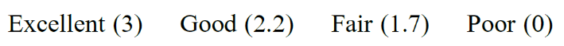

### Our rubric

We used a one-line rubric (specified in the config file) at the bottom of each question page; both the student copy and the instructor copy contained this information. All questions had the same value of three points each, which was evaluated according to the rubric below: 

The specific point values / percentages chosen were based on the required grading scale at UBC, which does not divide the space evenly; e.g., there is a 20% range of ‘A’ type grades at the top of the scale, and only a 4% range of ‘D’ type grades at the bottom of the scale. One reason for having all questions equally weighted despite their differences in difficulty was to help even out potential inequalities that came about because of the random selection of actual questions for each student. 
