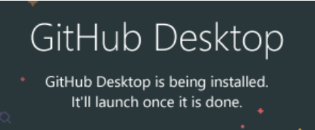

# Getting started with Python, GitHub, and $\LaTeX$

*Under construction -- coming soon!*

There are a few options when it comes to deciding how you will download/run the exam generator software, and subsequently typeset the generated $\LaTeX$ files to create PDFs. The list below describes these options and highlights which ones are recommended if you have not used any of these tools before.

 1. Download the Exam Generator source code and directory structure.
    - Recommended approach (slightly more complex, but will allow you to receive future software updates more easily): [Download/install/configure GitHub Desktop](#downloadinstallconfigure-github-desktop).
    - Alternative approach (less complex, but will be trickier to access future software updates): [Download repository from GitHub](#download-repository-from-github).
 3. Download/install Python as well as the necessary additional code dependencies: [Download/install/configure Python](#downloadinstallconfigure-python).
 4. TODO continued

## Download/install/configure GitHub Desktop

### For Windows users

 1. Go to https://desktop.github.com/ and download the latest version via the big purple button: 
 2. Run the installer by double-clicking the .exe file (probably named something like `GitHubDesktopSetup-x64.exe`) in your Downloads folder.
 3. GitHub Desktop should install itself and then automatically open when it’s done. 
 4. At this point you’ll need to sign in with your GitHub credentials.
    - If you don’t yet have an account, you can click the “Create your free account” link or set one up via the “Sign Up” button in the top right corner at https://github.com/. When it starts asking you questions about who you’re working with, what you’ll be using it for, etc, you can just click “skip personalization” at the bottom of the screen.
    - Once your account is up and running, flip back to GitHub Desktop and sign in via the “Sign in to GitHub.com” button. You’ll be asked to sign in via web browser and then authenticate GitHub Desktop. You should now be logged in via the GitHub Desktop window.
 5. Finally, you’ll need to configure GitHub Desktop to access the Exam Generation code so that you can run it (and keep it up-to-date) on your machine. In GitHub Desktop...
    - Click “Clone a repository from the internet” on the welcome screen.
    - Click the “URL” tab.
    - Copy and paste kvesik/examgeneration into the top field (“Repository URL or GitHub username and repository”), and in the bottom field (“Local path”) select a folder for the code to live in on your computer. Click “Clone.”
    - Clicking the “Fetch Origin” button at the top right is what refreshes your local copy of the code with any recent updates that have been made by the programmers. If it changes to “Pull Origin” after you click “Fetch Origin” you should click it again. “Fetch” checks to see if there are any updates, and “Pull” means there are in fact new updates that do need to be downloaded onto your computer.  You should open GitHub Desktop and fetch/pull every once in a while (monthly, maybe?). Other than that, though, you likely won’t need to use GitHub Desktop for much.

### For Mac users

 1. Go to https://desktop.github.com/ and download the latest version via the big purple button: 
 2. Unzip the installer by double-clicking the .zip file (probably named something like `GitHubDesktop-x64.zip`) in your Downloads folder.
 3. Once it has unzipped, double-click the GitHub Desktop.app file.
 4. GitHub Desktop should install itself and then automatically open when it’s done. 
 5. At this point you’ll need to sign in with your GitHub credentials.
    - If you don’t yet have an account, you can click the “Create your free account” link or set one up via the “Sign Up” button in the top right corner at https://github.com/. When it starts asking you questions about who you’re working with, what you’ll be using it for, etc, you can just click “skip personalization” at the bottom of the screen.
    - Once your account is up and running, flip back to GitHub Desktop and sign in via the “Sign in to GitHub.com” button. You’ll be asked to sign in via web browser and then authenticate GitHub Desktop. You should now be logged in via the GitHub Desktop window.
 6. Finally, you’ll need to configure GitHub Desktop to access the Exam Generation code so that you can run it (and keep it up-to-date) on your machine. In GitHub Desktop...
    - Click “Clone a repository from the internet” on the welcome screen.
    - Click the “URL” tab.
    - Copy and paste kvesik/examgeneration into the top field (“Repository URL or GitHub username and repository”), and in the bottom field (“Local path”) select a folder for the code to live in on your computer. Click “Clone.”
    - Clicking the “Fetch Origin” button at the top right is what refreshes your local copy of the code with any recent updates that have been made by the programmers. If it changes to “Pull Origin” after you click “Fetch Origin” you should click it again. “Fetch” checks to see if there are any updates, and “Pull” means there are in fact new updates that do need to be downloaded onto your computer.  You should open GitHub Desktop and fetch/pull every once in a while (monthly, maybe?). Other than that, though, you likely won’t need to use GitHub Desktop for much.

## Download repository from GitHub

TODO

## Download/install/configure Python

### For Windows users

TODO

### For Mac users

TODO

