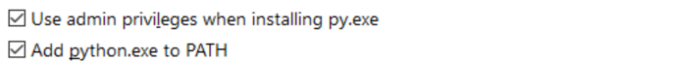
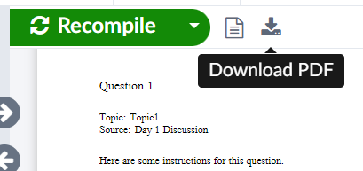

# Getting started with Python, GitHub, and $\LaTeX$

There are a few options when it comes to deciding how you will download/run the exam generator software, and subsequently typeset the generated $\LaTeX$ files to create PDFs. The list below describes these options (with links to detailed instructions) and highlights which ones are recommended if you have not used any of these tools before. Most of these tasks only need be done once, to set up your computer to be able to generate exams. However, the last two ("Run the Python script" and "Generate .pdfs using $\LaTeX$") will need to be done each time you want to generate a new set of exams.

 1. Download the Exam Generator source code and directory structure.
    - (a) Recommended approach (slightly more complex to set up than option b, but will allow you to receive future software updates more easily): [Download/install/configure GitHub Desktop](#i-downloadinstallconfigure-github-desktop).
    - (b) Alternative approach (less complex to set up than option a, but will be trickier to access future software updates): [Download repository from GitHub](#ii-download-repository-from-github).
 2. [Download/install/configure Python](#iii-downloadinstallconfigure-python) if you don't already have Python installed.
 3. [Download/install Python dependencies](#iv-downloadinstall-python-dependencies).
 4. Set up $\LaTeX$ either on your own computer or via an online account with Overleaf.
    - (a) If you already have a $\LaTeX$ editor installed on your computer, feel free to use it. If not,
    - (b) Recommended approach: [Get started with LaTeX using Overleaf](#v-get-started-with-latex-using-overleaf).
 5. [Run the Python script](#vi-run-the-python-script).
 6. [Generate .pdfs using LaTeX](#vii-generate-pdfs-using-latex).

## I. Download/install/configure GitHub Desktop

This task only needs to be done once (but NB the very last step-- 5d for Windows users / 6d for Mac users).

### GitHub Desktop for Windows users

 1. Go to https://desktop.github.com/ and download the latest version via the big purple button:
 
 <!--  -->
 
 2. Run the installer by double-clicking the .exe file (probably named something like `GitHubDesktopSetup-x64.exe`) in your Downloads folder.
 3. GitHub Desktop should install itself and then automatically open when it’s done.
 
 <!--  -->
 
 4. At this point you’ll need to sign in with your GitHub credentials.
    - (a) If you don’t yet have an account, you can click the "Create your free account" link or set one up via the "Sign Up" button in the top right corner at https://github.com/. When it starts asking you questions about who you’re working with, what you’ll be using it for, etc, you can just click "skip personalization" at the bottom of the screen.
    - (b) Once your account is up and running, flip back to GitHub Desktop and sign in via the "Sign in to GitHub.com" button. You’ll be asked to sign in via web browser and then authenticate GitHub Desktop. You should now be logged in via the GitHub Desktop window.

 5. Finally, you’ll need to configure GitHub Desktop to access the Exam Generation code so that you can run it (and keep it up-to-date) on your machine. In GitHub Desktop...
    - (a) Click "Clone a repository from the internet" on the welcome screen.
    - (b) Click the "URL" tab.
    - (c) Copy and paste kvesik/examgeneration into the top field ("Repository URL or GitHub username and repository"), and in the bottom field ("Local path") select a folder for the code to live in on your computer. Click "Clone."
    - (d) Clicking the "Fetch Origin" button at the top right is what refreshes your local copy of the code with any recent updates that have been made by the programmers. If it changes to "Pull Origin" after you click "Fetch Origin" you should click it again. "Fetch" checks to see if there are any updates, and "Pull" means there are in fact new updates that do need to be downloaded onto your computer.  You should open GitHub Desktop and fetch/pull every once in a while (monthly, maybe?). Other than that, though, you likely won’t need to use GitHub Desktop for much.

### GitHub Desktop for Mac users

 1. Go to https://desktop.github.com/ and download the latest version via the big purple button:
 
 <!--  -->
 
 2. Unzip the installer by double-clicking the .zip file (probably named something like `GitHubDesktop-x64.zip`) in your Downloads folder.
 3. Once it has unzipped, double-click the GitHub Desktop.app file.
 4. GitHub Desktop should install itself and then automatically open when it’s done.
  
 <!--  -->
 
 5. At this point you’ll need to sign in with your GitHub credentials.
    - (a) If you don’t yet have an account, you can click the "Create your free account" link or set one up via the "Sign Up" button in the top right corner at https://github.com/. When it starts asking you questions about who you’re working with, what you’ll be using it for, etc, you can just click "skip personalization" at the bottom of the screen.
    - (b) Once your account is up and running, flip back to GitHub Desktop and sign in via the "Sign in to GitHub.com" button. You’ll be asked to sign in via web browser and then authenticate GitHub Desktop. You should now be logged in via the GitHub Desktop window.
 6. Finally, you’ll need to configure GitHub Desktop to access the Exam Generation code so that you can run it (and keep it up-to-date) on your machine. In GitHub Desktop...
    - (a) Click "Clone a repository from the internet" on the welcome screen.
    - (b) Click the "URL" tab.
    - (c) Copy and paste kvesik/examgeneration into the top field ("Repository URL or GitHub username and repository"), and in the bottom field ("Local path") select a folder for the code to live in on your computer. Click "Clone."
    - (d) Clicking the "Fetch Origin" button at the top right is what refreshes your local copy of the code with any recent updates that have been made by the programmers. If it changes to "Pull Origin" after you click "Fetch Origin" you should click it again. "Fetch" checks to see if there are any updates, and "Pull" means there are in fact new updates that do need to be downloaded onto your computer.
 You should open GitHub Desktop and fetch/pull every once in a while (monthly, maybe?). Other than that, though, you likely won’t need to use GitHub Desktop for much.

## II. Download repository from GitHub

This task only needs to be done once.

 1. Go to https://github.com/kvesik/examgeneration, click on the green "Code" button on the right, and select "Download ZIP" from the menu that opens.
 
    
    <!--  -->
    
 2. Save the .zip archive to the folder where you'd like the Exam Generation software to live on your computer.
 3. Extract the .zip archive.

## III. Download/install/configure Python

This task only needs to be done once.

###  Python for Windows users

1. Go to https://www.python.org/downloads/ and download the latest version as per the big yellow button (3.11.1 in this case):

2. Run the installer by double-clicking the .exe file (probably named something like `python-3.11.1-amd64.exe`) in your Downloads folder. BUT WAIT! ...
3. Make sure the two boxes below are checked, then click "Install Now": 

4. Python should install itself and then display a success message.

### Python for Mac users

1. Go to https://www.python.org/downloads/ and download the latest version as per the big yellow button (3.9.4 in this case): 

2. Run the installer by double-clicking the package file (probably named something like `python-3.11.1-macos11.pkg`) in your Downloads folder.
3. Proceed through the installation.
4. Python should install itself and then display a success message.

## IV. Download/install Python dependencies

This task only needs to be done once, unless there is a big update to the software that references new code packages.

### Python dependencies for Windows users

 1. Using Windows file explorer, navigate to the `examgeneration` folder where you saved the GitHub repository in Section [I](#i-downloadinstallconfigure-github-desktop) or [II](#ii-download-repository-from-github) above.
 2. Hold down the Shift key while you right-click on the `src` folder.
 3. Choose "Open PowerShell window here" from the menu that pops up.
    - At this point the prompt in the PowerShell window should end with `\examgeneration\src>`. If it does not, you can either navigate *downward* by typing e.g. `cd src` or *upward* by typing `cd ..`
 4. Type or copy & paste `pip install --upgrade pip` at the prompt and hit Enter.
 5. Once the upgrade is done, type or copy & paste `pip install -r ../requirements.txt` and hit Enter. The corresponding installs might take a couple of minutes but not too long. These are the other code packages that the ExamGeneration script depends on in order to run properly.
 6. Once these packages are installed, you can close the PowerShell window.

### Python dependencies for Mac users

 1. Using Finder, navigate to the `examgeneration` folder where you saved the GitHub repository in Section [I](#i-downloadinstallconfigure-github-desktop) or [II](#ii-download-repository-from-github) above.
 2. Right-click on the `src` folder.
 3. Choose "New Terminal at Folder" from the menu that pops up.
    - At this point the prompt in the PowerShell window should end with `\examgeneration\src>`. If it does not, you can either navigate *downward* by typing e.g. `cd src` or *upward* by typing `cd ..`
    - If you don't see the "New Terminal at Folder" option, see [this video](https://www.youtube.com/watch?v=KqtKD8z-NRc) on how to enable it.
 4. Type or copy & paste `pip install --upgrade pip` at the prompt and hit Return.
 5. Once the upgrade is done, type or copy & paste `pip install -r ../requirements.txt` and hit Return. The corresponding installs might take a couple of minutes but not too long. These are the other code packages that the ExamGeneration script depends on in order to run properly.
 6. Once these packages are installed, you can close the Terminal window. 

## V. Get started with $\LaTeX$ using Overleaf

This task only needs to be done once.

 1. Go to [overleaf.com](https://www.overleaf.com/) and click "Register" at the top right.
 2. Follow the steps to create an account.
 3. You'll be uploading the contents of your `examgeneration/exams/` folder (including the `images/` subfolder to an Overleaf project once you've run the Python script as per Section [VI](#vi-run-the-python-script) below.
 4. Once you've uploaded those files and opened the project, you'll select the .tex file you want to typeset from the menu on the left, and then click the green "Recompile" button near the top of the right-hand side of the screen.

## VI. Run the Python script

This task needs to be done each time you want to generate a new set of exams, followed by task [VII](#vii-generate-pdfs-using-latex).

### Running the Python script for Windows users

 1. Make sure you have set up your config files, question database, student list, etc according to the guidelines in the main [Readme](README.md) document.
 2. Using Windows file explorer, navigate to the `examgeneration` folder where you saved the GitHub repository in Section [I](#i-downloadinstallconfigure-github-desktop) or [II](#ii-download-repository-from-github) above.
 3. Hold down the Shift key while you right-click on the `src` folder.
 4. Choose "Open PowerShell window here" from the menu that pops up.
    - At this point the prompt in the PowerShell window should end with `\examgeneration\src>`. If it does not, you can either navigate *downward* by typing e.g. `cd src` or *upward* by typing `cd ..`
 6. Type `python generateexams.py` and press Enter (or you might have to try `python3 generateexams.py` if the first attempt doesn’t work).
 7. The script does not have a GUI (Graphical User Interface); you will interact with in the PowerShell window, via the keyboard. Follow the directions provided in PowerShell.

### Running the Python script for Mac users

 1. Make sure you have set up your config files, question database, student list, etc according to the guidelines in the main [Readme](README.md) document.
 2. Using Finder, navigate to the `examgeneration` folder where you saved the GitHub repository in Section [I](#i-downloadinstallconfigure-github-desktop) or [II](#ii-download-repository-from-github) above.
 3. Right-click on the `src` folder.
 4. Choose "New Terminal at Folder" from the menu that pops up.
    - At this point the prompt in the PowerShell window should end with `\examgeneration\src>`. If it does not, you can either navigate *downward* by typing e.g. `cd src` or *upward* by typing `cd ..`
 5. Type `python generateexams.py` and press Return (or you might have to try `python3 generateexams.py` if the first attempt doesn’t work).
 6. The script does not have a GUI (Graphical User Interface); you will interact with in the Terminal window, via the keyboard. Follow the directions provided in Terminal.

## VII. Generate .pdfs using $\LaTeX$

This task needs to be done each time you want to generate a new set of exams, following task [VI](#vi-run-the-python-script). 

If you already have $\LaTeX$ installed on your computer and are familiar with how to use it, feel free to open the .tex files generated in task [VI](#vi-run-the-python-script) and compile into .pdf files as usual (note that you will need to use XeTex because of the font packages used by this tool).

However, if you are new to $\LaTeX$ and have just opened an Overleaf account in task [V](#v-get-started-with-latex-using-overleaf) above, then follow the instructions below.

 1. Select the exam folder and the `images` folder generated in task [VI](#vi-run-the-python-script) and compress them into a .zip file.

    
    <!--  -->
    
 2. Log into [Overleaf](https://www.overleaf.com/project).
 3. Click "New Project" at the top left, and select "Upload Project" from the menu that appears.

    
    <!--  -->

 4. Select or drag into Overleaf the .zip file you just created.
 5. You will likely see some errors on the right-hand side of the page. In order to succesfully compile the .tex files into .pdf files, click the Menu button at the top left of the page and select "XeLaTex" in the Compiler menu under Settings.

    
    <!--  -->

 6. Click back in the main part of the project window, select your desired .tex file (question bank? exam? instructor copy?) in the list on the left-hand side, and click "Recompile" at the top right of the page. You should now see a formatted document on the right-hand side of the screen. You can download this to your computer by clicking the "Download PDF" button above the document.

    
    <!--  -->

Anytime you regenerate new exam .tex files using the python script on your computer, you can choose to either update this existing Overleaf project or simply create a new one again as per the instructions above. Your choise might depend on whether you want to keep the exam files organized in Overleaf as well, or use it solely for generating the .pdf files which you then store back on your local machine.

